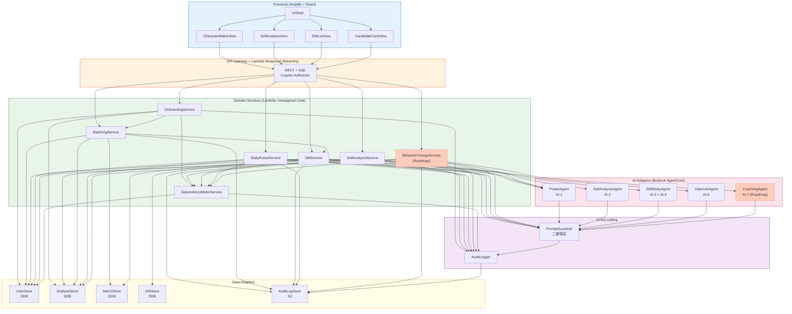
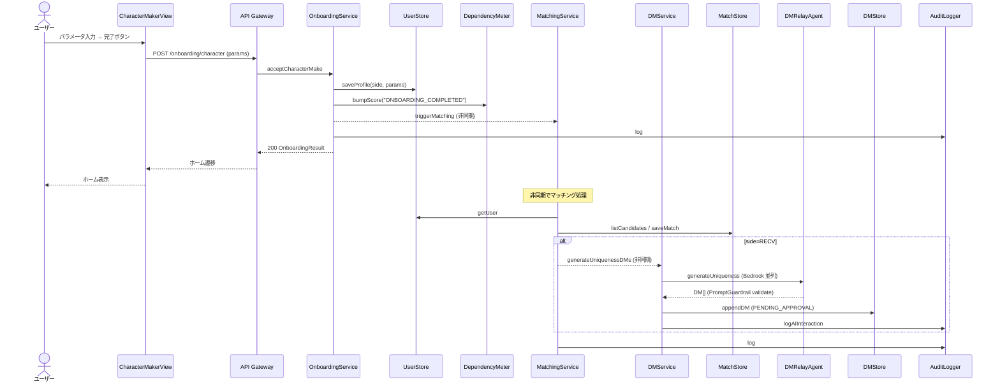
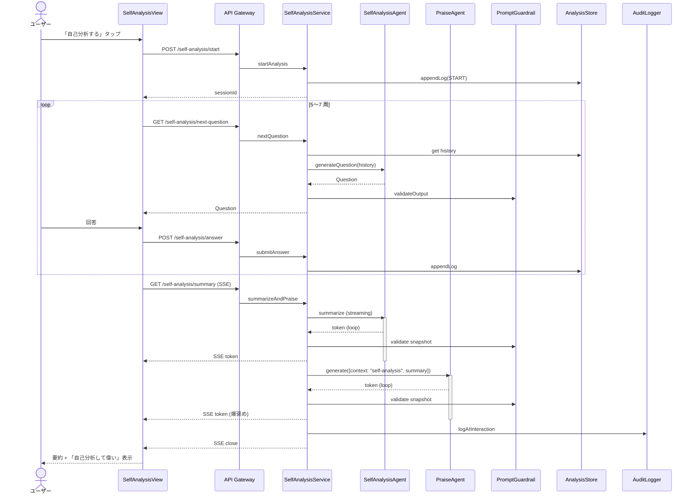
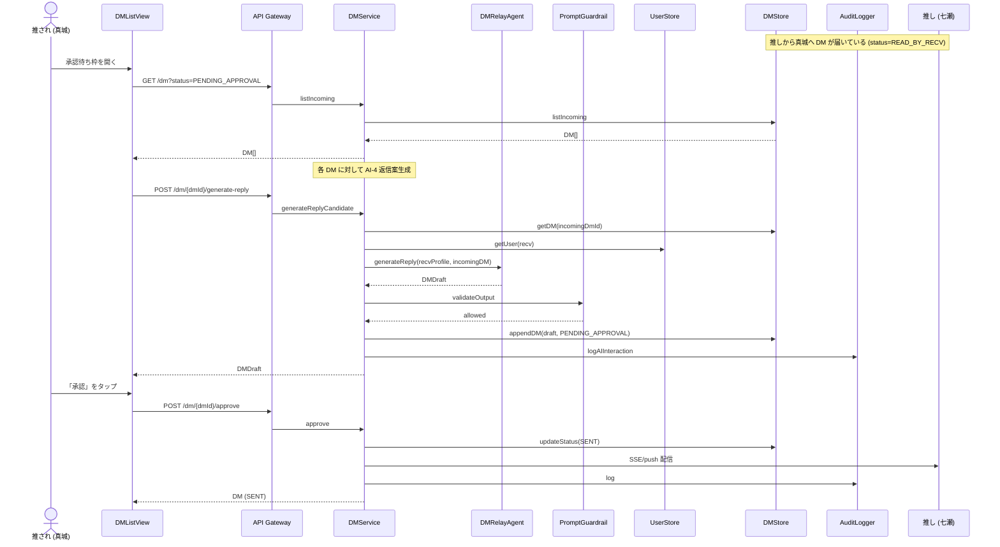
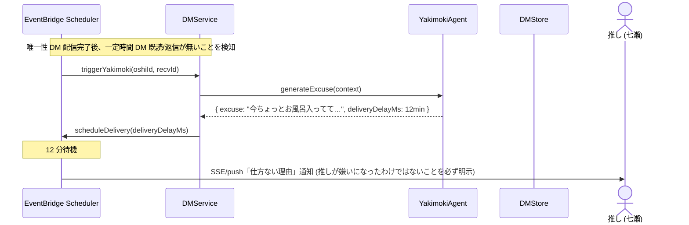

# Component Dependency — 推されと推し

**プロダクト**: 推されと推し
**フェーズ**: AI-DLC Inception / Application Design
**作成日**: 2026-05-09
**スコープ**: コンポーネント間の依存関係 / 通信パターン / データフロー
**準拠**: `components.md` / `component-methods.md` / `services.md`

---

## 1. 全体依存マトリクス

「○」は呼び出す側 (行) → 呼び出される側 (列) を示す。

|  | UIShell | CharacterMakerView | SelfAnalysisView | DMListView | CandidateCardView | OnboardingService | SelfAnalysisService | MatchingService | DMService | DailyPraiseService | DependencyMeterService | BehaviorChangeService (RM) | PraiseAgent | SelfAnalysisAgent | DMRelayAgent | YakimokiAgent | CoachingAgent (RM) | PromptGuardrail | AuditLogger | UserStore | AnalysisStore | MatchStore | DMStore | AuditLogStore |
|---|---|---|---|---|---|---|---|---|---|---|---|---|---|---|---|---|---|---|---|---|---|---|---|---|
| **CharacterMakerView** | — | — | — | — | — | ○ | — | — | — | — | — | — | — | — | — | — | — | — | — | — | — | — | — | — |
| **SelfAnalysisView** | — | — | — | — | — | — | ○ | — | — | — | — | — | — | — | — | — | — | — | — | — | — | — | — | — |
| **DMListView** | — | — | — | — | — | — | — | — | ○ | — | — | — | — | — | — | — | — | — | — | — | — | — | — | — |
| **CandidateCardView** | — | — | — | — | — | — | — | ○ | — | — | — | — | — | — | — | — | — | — | — | — | — | — | — | — |
| **OnboardingService** | — | — | — | — | — | — | — | ○ | — | — | ○ | — | — | — | — | — | — | — | ○ | ○ | — | — | — | — |
| **SelfAnalysisService** | — | — | — | — | — | — | — | — | — | — | ○ | — | ○ | ○ | — | — | — | ○ | ○ | — | ○ | — | — | ○ |
| **MatchingService** | — | — | — | — | — | — | — | — | ○ | — | — | — | — | — | — | — | — | — | ○ | ○ | — | ○ | — | ○ |
| **DMService** | — | — | — | — | — | — | — | ○ | — | — | ○ | — | — | — | ○ | ○ | — | ○ | ○ | ○ | — | ○ | ○ | ○ |
| **DailyPraiseService** | — | — | — | — | — | — | — | — | — | — | ○ | — | ○ | — | — | — | — | ○ | ○ | ○ | ○ | — | — | ○ |
| **DependencyMeterService** | — | — | — | — | — | — | — | — | — | — | — | — | — | — | — | — | — | — | ○ | ○ | — | — | — | ○ |
| **BehaviorChangeService (RM)** | — | — | — | — | — | — | — | — | — | — | ○ | — | ○ | — | — | — | ○ | ○ | ○ | ○ | ○ | — | — | ○ |
| **PraiseAgent / SelfAnalysisAgent / DMRelayAgent / YakimokiAgent / CoachingAgent** | — | — | — | — | — | — | — | — | — | — | — | — | — | — | — | — | — | ○ (System Prompt 注入) | — | — | — | — | — | — |
| **PromptGuardrail** | — | — | — | — | — | — | — | — | — | — | — | — | — | — | — | — | — | — | ○ | — | — | — | — | ○ |
| **AuditLogger** | — | — | — | — | — | — | — | — | — | — | — | — | — | — | — | — | — | — | — | — | — | — | — | ○ |

### 依存ルール (ヘキサゴナル境界)

1. **Frontend → Service** のみ。Frontend は AI Adapter / Data Adapter に直接依存しない (API Gateway 経由)
2. **Service → AI Adapter / Data Adapter / Cross-cutting** は許容。Service 同士の呼び出しは許容
3. **AI Adapter / Data Adapter は Service に依存しない** (一方向)
4. **Cross-cutting (Guardrail / AuditLogger) は単独で完結**。各 Service / AI Adapter から呼ばれる
5. **Service 同士の呼び出し**: OnboardingService → MatchingService → DMService の連鎖が中心。逆向きはない (循環依存なし)

---

## 2. レイヤード依存図 (Mermaid)



> Roadmap (BehaviorChangeService / CoachingAgent) は MVP 範囲外のため点線で示す。

---

## 3. 主要シーケンス図

### 3.1 US-COM-01 オンボーディング & 両側マッチング起動 (Mermaid)



### 3.2 US-COM-02 自己分析 → 要約 → 爆褒めチェイン (Mermaid)



### 3.3 US-RECV-01 推され側 — AI が DM 返信案を代理生成 → 承認 (Mermaid)



### 3.4 US-OSHI-01 唯一性 DM 受信 + ヤキモキ演出 (Mermaid)



---

## 4. データフロー図

### 4.1 マスター情報フロー

```
キャラメイク入力 → CharacterMakerView → OnboardingService → UserStore (PROFILE)
                                                          → MatchingService → MatchStore (MATCH)
                                                                            → DMService (RECV 側のみ)
                                                                              → DMStore (PENDING_APPROVAL)
```

### 4.2 AI 対話フロー (推し側 DM 受信)

```
[推され実ユーザー (真城)] のキャラメイク + マッチング成立
        ↓
DMRelayAgent.generateUniqueness (AI-3) — System Prompt + Bedrock Guardrails の二重保証
        ↓
PromptGuardrail.validateOutput — NG ワード検査 + 違反検出は AuditLogger へ
        ↓
DMStore に PENDING_APPROVAL で保存
        ↓
[推され実ユーザー本人] が承認 → DMService.approve → status=SENT
        ↓
[推し実ユーザー (七瀬)] へ配信 (SSE)
```

### 4.3 監査ログフロー (NFR-OBS-01, 02)

```
全 AI 対話 → AuditLogger.logAIInteraction → CloudWatch Logs (運用)
                                          → AuditLogStore (S3 JSON Lines)
                                              → Athena でクエリ可能
                                                  → プロンプト品質後評価 (NFR-OBS-01)
                                                  → 倫理違反集計 (NFR-OBS-02)

PromptGuardrail 違反検出 → AuditLogger.logViolation → 同上
```

---

## 5. 通信パターンサマリ

| 通信 | プロトコル | パターン | 例 |
| --- | --- | --- | --- |
| Front ↔ API Gateway | HTTPS REST + SSE | 同期 / ストリーミング | キャラメイク POST / 自己分析 SSE |
| API Gateway ↔ Lambda | AWS Lambda 統合 | Lambda Response Streaming 対応 | summarizeAndPraise |
| Lambda ↔ Lambda (内部 Service) | EventBridge / 非同期 invoke | 非同期 fire-and-forget | OnboardingService → MatchingService.triggerMatching |
| Lambda ↔ Bedrock | Bedrock SDK | 同期 (streaming あり) | PraiseAgent.generate |
| Lambda ↔ DDB | DDB SDK | 同期 KV / Query | UserStore / MatchStore / DMStore |
| Lambda ↔ S3 | S3 SDK | 非同期 (PutObject) | AuditLogStore |
| 遅延配信 | EventBridge Scheduler | 非同期スケジュール | ヤキモキ演出 (5〜30 分後通知) |

---

## 6. 循環依存検証

主要呼び出し方向:
```
Frontend → API Gateway → Service → (AI Adapter | Data Adapter | Cross-cutting | 他 Service)
```

Service 間の連鎖:
- OnboardingService → MatchingService → DMService (連鎖、逆向き無し)
- DMService → DependencyMeterService (横断、逆向き無し)
- BehaviorChangeService → DependencyMeterService (横断、逆向き無し)

→ **循環依存なし**。各 Service / Adapter は独立に単体テスト可能。

---

## 7. NFR との整合性

| NFR | 依存パターンでの対応 |
| --- | --- |
| NFR-PERF-01 (3 秒応答) | フロント → API Gateway → Lambda Response Streaming → Bedrock streaming の経路を最短化、初動 1〜2 秒目標 |
| NFR-ARCH-01 (Bedrock AgentCore Serverless) | 全層が Lambda + Bedrock + DDB + S3 のフルサーバレス、依存関係は SDK 呼び出しのみ |
| NFR-ETH-01〜08 | PromptGuardrail を AI Adapter のラッパとして強制注入 (System Prompt + Bedrock Guardrails 二重) |
| NFR-OBS-01, 02 | AuditLogger を Service 層から非同期で呼ぶ + AuditLogStore で 90 日アーカイブ |
| NFR-PERF-01 (10 ユーザー同時接続) | Lambda 同時実行数とリザーブドコンカレンシ設定 (CONSTRUCTION で詳細化) |
