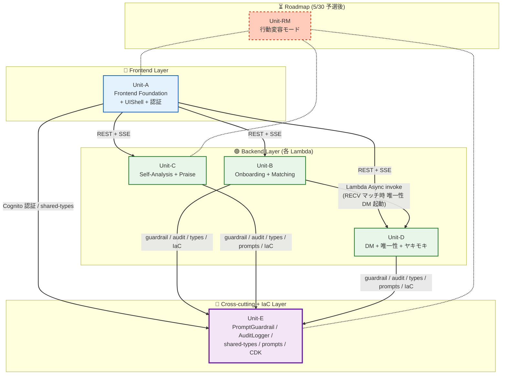

# Unit of Work Dependency — 推されと推し

**プロダクト**: 推されと推し
**フェーズ**: AI-DLC Inception / Units Generation
**作成日**: 2026-05-09
**スコープ**: Unit 間の依存関係 / 通信パターン / ビルド順序
**準拠**: `unit-of-work.md` / `application-design.md` Section 1〜4 / `component-dependency.md`

---

## 1. Unit 依存マトリクス

「○」は左の Unit (行) が上の Unit (列) に依存することを示す。

| | Unit-A Frontend | Unit-B Onboarding | Unit-C Praise | Unit-D DM | Unit-E Cross/IaC | Unit-RM (RM) |
| --- | --- | --- | --- | --- | --- | --- |
| **Unit-A Frontend** | — | ○ (REST 呼び出し) | ○ (REST + SSE) | ○ (REST + SSE) | ○ (Cognito + shared-types) | (将来) |
| **Unit-B Onboarding** | — | — | — | ○ (Lambda Async invoke / DM 唯一性起動) | ○ (guardrail / audit-logger / shared-types / IaC) | — |
| **Unit-C Praise** | — | — | — | — | ○ (guardrail / audit-logger / shared-types / prompts / IaC) | — |
| **Unit-D DM** | — | — | — | — | ○ (guardrail / audit-logger / shared-types / prompts / IaC) | — |
| **Unit-E Cross/IaC** | — | — | — | — | — | — |
| **Unit-RM (RM)** | (将来 ○) | — | (将来 ○) | — | (将来 ○) | — |

**読み方**:
- Unit-A は B/C/D/E に依存 (フロントから API を叩く / 共通型を使う)
- Unit-B は D に非同期で依存 (RECV 側マッチ成立時に DMService.generateUniquenessDMs を起動)
- Unit-B/C/D は **すべて Unit-E に依存** (横断機能 Guardrail / AuditLogger / 共通型 / プロンプト断片 / IaC)
- Unit-E は他 Unit に依存しない (一方向)
- Roadmap Unit-RM は将来有効化時に A/C/E に依存

---

## 2. レイヤー別依存図 (Mermaid)



> **Unit-E は依存ゼロ**で、他 Unit が Unit-E に一方向に依存する。これにより Unit-E を最初に整備すれば残り 4 Unit は並行実装可能。

---

## 3. 通信パターン詳細

### 3.1 Unit 間の通信種別

| 起点 | 終点 | 通信種別 | 同期/非同期 | 実装手段 | 主な使用シーン |
| --- | --- | --- | --- | --- | --- |
| **Unit-A** | Unit-B | REST | 同期 | API Gateway → Lambda | キャラメイク POST / 候補取得 GET |
| **Unit-A** | Unit-C | REST + **SSE** | 同期 / ストリーミング | API Gateway + Lambda Response Streaming | 自己分析要約 / 日次褒め |
| **Unit-A** | Unit-D | REST + SSE | 同期 / ストリーミング | API Gateway + Lambda Response Streaming | DM 一覧 / 承認 / SSE 受信 |
| **Unit-A** | Unit-E | (Cognito 認証) | 同期 | Cognito SDK / Amplify Auth | ログイン |
| **Unit-A** | Unit-E | (型インポート) | ビルド時 | pnpm workspace + TypeScript Project References | DTO 共有 |
| **Unit-B** | Unit-D | **Lambda Async invoke** | 非同期 fire-and-forget | AWS SDK (InvokeAsync) | RECV マッチング成立時に唯一性 DM 並列生成を起動 |
| **Unit-B/C/D** | Unit-E | (関数インポート) | 同期 (in-process) | pnpm package import | guardrail / audit-logger / prompts / shared-types を呼び出し |
| **Unit-D Scheduler** | Unit-D Lambda | EventBridge Scheduler | 非同期 (時間遅延) | EventBridge Scheduler ルール | ヤキモキ 5〜30 分後通知 |
| **Unit-D** | Unit-A | SSE / push | 非同期 | API Gateway WebSocket or SSE 再接続 | 推し向け DM 配信 / ヤキモキ通知 |

### 3.2 通信プロトコル選定の根拠

- **REST + SSE**: NFR-PERF-01 (3 秒応答) と Bedrock streaming を素直に組み合わせられる。Lambda Response Streaming で実装
- **Lambda Async invoke** (Unit-B → Unit-D): キャラメイク完了レスポンスは 3 秒以内に返したいが、唯一性 DM 並列生成は数秒〜数十秒かかるため非同期化
- **EventBridge Scheduler**: ヤキモキ演出の遅延配信 (5〜30 分後)。Lambda 単体では遅延実行できないため
- **Lambda 同期 invoke は使わない**: コスト + レイテンシ面で不利、NFR-PERF-01 を圧迫

---

## 4. ビルド順序とデプロイ順序

### 4.1 ビルド順序 (Turborepo 依存解決)

```
[1] Unit-E パッケージ群 (依存ゼロ)
    ├─ packages/shared-types
    ├─ packages/guardrail (← shared-types に依存)
    ├─ packages/audit-logger (← shared-types に依存)
    └─ packages/prompts (← shared-types に依存)
        ↓
[2] Unit-B / Unit-C / Unit-D (並行可、Unit-E に依存)
    ├─ apps/backend-onboarding
    ├─ apps/backend-praise
    ├─ apps/backend-dm
    └─ apps/scheduler-yakimoki
        ↓
[3] Unit-A (Unit-E shared-types に依存、API は実行時呼び出し)
    └─ apps/frontend
        ↓
[4] Unit-E IaC (CDK)
    └─ infra/  ← Lambda コード成果物 + Frontend ビルド成果物 を参照してデプロイ
```

### 4.2 デプロイ順序 (CDK 一括デプロイ前提)

`cdk deploy --all` で以下を一括デプロイ:

1. **CognitoStack** (Unit-A の認証基盤 + Unit-E の Auth)
2. **DdbStack** (Unit-B/C/D が参照する Single-Table)
3. **S3AuditStack** (Unit-E AuditLogStore)
4. **BedrockGuardrailsStack** (Unit-E の Bedrock Guardrails 設定)
5. **LambdaStack** (Unit-B/C/D の各 Lambda + Unit-D の Scheduler 用 Lambda)
6. **ApiGatewayStack** (Unit-A から呼ぶ REST + SSE エンドポイント)
7. **EventBridgeSchedulerStack** (Unit-D ヤキモキ用)
8. **AmplifyStack** (Unit-A Frontend ホスティング)

### 4.3 5/15 開発初日のセットアップ順序 (推奨)

5/15 書類審査結果発表後、開発を開始する場合の推奨順序:

1. **Day 1 (5/15)**: Unit-E 担当が `infra/` の CDK Stack を整備 → 開発用 AWS 環境にデプロイ → 各担当が AWS リソースに到達できる状態を作る
2. **Day 1〜2**: Unit-E 担当が `packages/{shared-types, guardrail, audit-logger, prompts}` を初版整備 → 各 Unit 担当が import 可能に
3. **Day 2 以降**: Unit-A / B / C / D を 4 名で並行実装

---

## 5. 循環依存検証

### 5.1 検証方針
- Turborepo のタスクグラフ生成で循環依存があれば自動検出
- TypeScript Project References でも循環依存はビルドエラーになる

### 5.2 設計時点での検証

```
Unit-A → {B, C, D, E}
Unit-B → {D, E}
Unit-C → {E}
Unit-D → {E}
Unit-E → {} (依存ゼロ)
```

**循環なし**を確認。Unit-A が起点 (Frontend)、Unit-E が終点 (横断 / 依存ゼロ)。中間で B → D の単方向依存があるが循環は形成しない。

### 5.3 設計上の注意

- Unit-D から Unit-B への依存は禁止 (現在は無い)
- Unit-E は他 Unit に**絶対**依存しない (横断機能の純粋性を保つ)
- Unit-RM (Roadmap) を有効化する際も A/C/E への依存のみで循環を作らない

---

## 6. Unit 間データフロー

### 6.1 主要データフロー: 両側マッチング → 唯一性 DM 配信 (US-COM-01 → US-OSHI-01)

```
[Frontend Unit-A]
    ↓ POST /onboarding/character (REST)
[Unit-B] OnboardingService
    ├─ UserStore.saveProfile (DDB)
    ├─ MatchingService.triggerMatching
    │     ↓ side=RECV のとき
    │     Lambda Async invoke
    │     ↓
    │  [Unit-D] DMService.generateUniquenessDMs
    │     ├─ DMRelayAgent (AI-3) 並列呼び出し
    │     │     ↑ packages/prompts (Unit-E)
    │     │     ↑ packages/guardrail (Unit-E) で出力検証
    │     ├─ DMStore.appendDM (PENDING_APPROVAL)
    │     └─ packages/audit-logger (Unit-E) でログ
    └─ レスポンス 200 OnboardingResult (3 秒以内 / NFR-PERF-01)
```

### 6.2 主要データフロー: 自己分析 SSE チェイン (US-COM-02)

```
[Frontend Unit-A]
    ↓ GET /self-analysis/summary (SSE)
[Unit-C] SelfAnalysisService.summarizeAndPraise
    ├─ SelfAnalysisAgent (AI-2) ストリーミング要約
    │     ↑ packages/prompts (Unit-E)
    │     各 token: packages/guardrail (Unit-E) で検証
    ├─ チェイン: PraiseAgent (AI-1) 爆褒め生成
    │     ↑ packages/prompts (Unit-E)
    │     各 token: packages/guardrail (Unit-E) で検証
    └─ packages/audit-logger (Unit-E) で AI 入出力ログ
       ↓ SSE で逐次返却
[Frontend Unit-A] 受信 → アニメーション表示
```

### 6.3 主要データフロー: ヤキモキ演出 (US-OSHI-01)

```
[Unit-D] DMService が DM 既読スルーを検知
    ↓ EventBridge Scheduler ルール作成 (deliveryDelayMs 後発火)
[EventBridge Scheduler]
    ↓ 5〜30 分後
[Unit-D Scheduler Lambda] yakimoki ハンドラ
    ├─ YakimokiAgent (AI-5) で「仕方ない理由」生成
    │     ↑ packages/prompts (Unit-E)
    └─ Frontend Unit-A 経由で推しに通知 (SSE / push)
```

---

## 7. 統合テスト境界 (Build and Test ステージで使用)

| テスト境界 | 主担当 Unit | 確認内容 |
| --- | --- | --- |
| Unit 内単体テスト | 各 Unit | Service / Adapter / AI Agent のロジック (NFR-QA-03 TDD) |
| Unit 間 統合テスト | Unit 連携を担当する PR | 例: Unit-B → Unit-D Async invoke の到達確認 / Unit-A → Unit-C SSE の最後まで受信 |
| プロンプトテスト | Unit-C / Unit-D | 各 AI Agent の System Prompt 品質 / NG ワード混入無し (NFR-QA-02 / NFR-ETH) |
| 倫理ガードレール統合テスト | Unit-E が代表検証 | 全 AI 出力経路で Guardrail 二重保証が動作 |
| デモ台本シーン #1〜#6 テスト | 全 Unit 連携 | `stories.md` 付録 B のシーンが連続的に流れる (NFR-QA-02) |
| パフォーマンステスト | Unit-E (CloudWatch メトリクス) | NFR-PERF-01 (3 秒以内) / NFR-PERF-02 (10 同時) |

---

## 8. リリース戦略 / 環境分離

### 8.1 環境

| 環境 | 用途 | 担当 |
| --- | --- | --- |
| dev | 開発者個人ローカル + AWS サンドボックス | 各担当 (Unit ごと) |
| staging | チーム統合 + デモ台本通し検証 | Unit-E 担当が CDK で管理 |
| prod (5/30 当日) | 予選会デモ | Unit-E 担当 |

### 8.2 リリースフロー

```
個人ブランチ (`feature/unit-x-yyy`)
  ↓ PR
main ブランチ (CI: turbo build + test 全件パス)
  ↓ Amplify Console / cdk deploy --context env=staging
staging 環境 (デモ台本テスト)
  ↓ チーム承認
cdk deploy --context env=prod
prod (5/30 当日デモ)
```

### 8.3 ロールバック戦略

- CDK Stack のバージョン管理: `cdk deploy --previous-parameters` でロールバック可能
- Frontend (Amplify): デプロイ履歴から旧バージョンに戻す
- DDB データ: PITR (Point-in-time Recovery) を有効化 (5/15 開発初日に Unit-E で設定)

---

## 9. 補足: Unit-RM (Roadmap) を有効化する場合

5/30 予選通過後、6/26 決勝に向けて Unit-RM を実装着手する場合:

1. Unit-A (Frontend) にアシスタントキャラ作成 UI を拡張 (CharacterMakerView を拡張)
2. 新規 Unit-RM Lambda (`apps/backend-behavior-change`) を追加
3. Unit-E `packages/prompts` に `coaching-prompts.ts` を追加 (CoachingAgent 用 System Prompt + 「あなたを変えています」発話禁止ルール)
4. UserStore に AssistantCharacter エンティティ追加 (PK=`USER#{userId}`, SK=`ASSISTANT_CHAR`)
5. CDK Stack に bedrock-coaching-agent.ts を追加

→ 既存 Unit-A/B/C/D の責務には影響しない設計 (横展開しやすい)。
