# Execution Plan — 推されと推し

**プロダクト**: 推されと推し / AI による洗脳で気づいたら幸せになってるあなたと私
**チーム**: t4g.lazy.4xlarge
**作成日**: 2026-05-09
**フェーズ**: AI-DLC Inception / Workflow Planning
**プロジェクト種別**: Greenfield
**準拠**: `requirements.md` / `personas.md` / `stories.md` / `user-stories-assessment.md` / `story-generation-plan.md`

---

## 1. Detailed Analysis Summary

### 1.1 プロジェクト概要
- AWS Summit Japan 2026 AI-DLC ハッカソン参加プロジェクト
- 「人をダメにする」テーマに対し「推され × 推し の両面市場 + AI による感情労働代行 + 行動変容モードによる OS 再インストール」で回答
- Greenfield (既存コード無し)
- 5/10 書類審査 → 5/30 予選会 (麻布台ヒルズ AWS) → 6/26 決勝 (幕張メッセ AWS Summit)

### 1.2 Change Impact Assessment

| 観点 | 該当 | 内容 |
| --- | --- | --- |
| User-facing changes | ✅ Yes | 全機能が新規ユーザー向け体験 (4 ペルソナ × 8 ストーリー) |
| Structural changes | ✅ Yes | Greenfield のため全構造を新規構築 |
| Data model changes | ✅ Yes | User / Mode / PraiseProfile / SelfAnalysisLog / ActionLog / Match / DM / Ranking |
| API changes | ✅ Yes | フロント ↔ Bedrock AgentCore / Lambda 経由の API 全面新規 |
| NFR impact | ✅ Yes | Bedrock AgentCore Serverless / 同時 10 ユーザー / 3 秒応答 / 倫理 8 制約 / プロンプトテスト |

### 1.3 Risk Assessment

| 項目 | 評価 |
| --- | --- |
| Risk Level | **Medium** (Greenfield + ハッカソン MVP / 5/30 までに 4 名で実装する時間制約) |
| Rollback Complexity | **Easy** (新規構築のため過去資産を壊さない) |
| Testing Complexity | **Moderate** (AI 出力品質テスト / プロンプトテスト / 倫理ガードレール検証 を含む) |

### 1.4 主要リスクと緩和策

| リスク | 緩和策 |
| --- | --- |
| AI 任せ範囲の実装ボリューム (US-OSHI-01, US-RECV-01 が SP=L) | Units Generation で AI 部分を独立 Unit に切り出し、4 名で並行実装可能にする |
| 倫理ガードレール (NFR-ETH-01〜08) のプロンプト埋め込み漏れ | Construction Phase で各 Unit のプロンプトテストに NG ワードチェックを必須化 |
| 5/30 予選会までの実装タイト感 (約 2 週間) | MVP スコープを「行動かわらないモード × 推し/推され 各 1 ペルソナ」に絞り、ロードマップ (行動変容モード) は UI 非活性で示すのみ |
| 要件書側の漏れ (推され視点のマッチング機能 / AI-7 コーチング / 唯一性 DM の AI 代理人化) | Application Design 着手前に要件書追補を実施するかをユーザー判断に仰ぐ (本計画書 Section 5 で明示) |

---

## 2. Workflow Visualization

```mermaid
flowchart TD
    Start(["プロジェクト開始<br/>2026-05-06"])

    subgraph INCEPTION["🔵 INCEPTION PHASE"]
        WD["Workspace Detection<br/><b>COMPLETED</b>"]
        RE["Reverse Engineering<br/><b>SKIP (Greenfield)</b>"]
        RA["Requirements Analysis<br/><b>COMPLETED</b>"]
        US["User Stories<br/><b>COMPLETED</b>"]
        WP["Workflow Planning<br/><b>IN PROGRESS</b>"]
        AD["Application Design<br/><b>EXECUTE</b>"]
        UG["Units Generation<br/><b>EXECUTE</b>"]
    end

    subgraph CONSTRUCTION["🟢 CONSTRUCTION PHASE (5/15〜5/30)"]
        FD["Functional Design<br/><b>EXECUTE per Unit</b>"]
        NFRA["NFR Requirements<br/><b>EXECUTE per Unit</b>"]
        NFRD["NFR Design<br/><b>EXECUTE per Unit</b>"]
        ID["Infrastructure Design<br/><b>EXECUTE per Unit</b>"]
        CG["Code Generation<br/>(Planning + Generation)<br/><b>EXECUTE per Unit</b>"]
        BT["Build and Test<br/><b>EXECUTE</b>"]
    end

    subgraph OPERATIONS["🟡 OPERATIONS PHASE"]
        OPS["Operations<br/><b>PLACEHOLDER</b>"]
    end

    Submit5_10(["📄 5/10 書類審査提出<br/>requirements / personas / stories / app-design / units"])
    Submit5_30(["🎬 5/30 予選会<br/>MVP デモ + プレゼン"])
    Submit6_26(["🏆 6/26 決勝<br/>AWS Summit Japan"])

    Start --> WD
    WD --> RE
    RE --> RA
    RA --> US
    US --> WP
    WP --> AD
    AD --> UG
    UG --> Submit5_10
    Submit5_10 --> FD
    FD --> NFRA
    NFRA --> NFRD
    NFRD --> ID
    ID --> CG
    CG --> BT
    BT --> Submit5_30
    Submit5_30 --> OPS
    OPS --> Submit6_26
    Submit6_26 --> End(["Complete"])

    style WD fill:#4CAF50,stroke:#1B5E20,stroke-width:3px,color:#fff
    style RE fill:#BDBDBD,stroke:#424242,stroke-width:2px,stroke-dasharray: 5 5,color:#000
    style RA fill:#4CAF50,stroke:#1B5E20,stroke-width:3px,color:#fff
    style US fill:#4CAF50,stroke:#1B5E20,stroke-width:3px,color:#fff
    style WP fill:#FFA726,stroke:#E65100,stroke-width:3px,color:#000
    style AD fill:#FFA726,stroke:#E65100,stroke-width:3px,stroke-dasharray: 5 5,color:#000
    style UG fill:#FFA726,stroke:#E65100,stroke-width:3px,stroke-dasharray: 5 5,color:#000
    style FD fill:#FFA726,stroke:#E65100,stroke-width:3px,stroke-dasharray: 5 5,color:#000
    style NFRA fill:#FFA726,stroke:#E65100,stroke-width:3px,stroke-dasharray: 5 5,color:#000
    style NFRD fill:#FFA726,stroke:#E65100,stroke-width:3px,stroke-dasharray: 5 5,color:#000
    style ID fill:#FFA726,stroke:#E65100,stroke-width:3px,stroke-dasharray: 5 5,color:#000
    style CG fill:#4CAF50,stroke:#1B5E20,stroke-width:3px,color:#fff
    style BT fill:#4CAF50,stroke:#1B5E20,stroke-width:3px,color:#fff
    style OPS fill:#FFF59D,stroke:#F57F17,stroke-width:2px,stroke-dasharray: 5 5,color:#000
    style Start fill:#CE93D8,stroke:#6A1B9A,stroke-width:3px,color:#000
    style End fill:#CE93D8,stroke:#6A1B9A,stroke-width:3px,color:#000
    style Submit5_10 fill:#FFD54F,stroke:#FF6F00,stroke-width:3px,color:#000
    style Submit5_30 fill:#FFD54F,stroke:#FF6F00,stroke-width:3px,color:#000
    style Submit6_26 fill:#FFD54F,stroke:#FF6F00,stroke-width:3px,color:#000

    linkStyle default stroke:#333,stroke-width:2px
```

**凡例**:
- 🟢 緑 (実線): 完了 or 必須実行ステージ
- 🟧 オレンジ (実線): 進行中ステージ
- 🟧 オレンジ (破線): EXECUTE 予定ステージ
- ⬜ 灰色 (破線): SKIP ステージ
- 🟨 黄色 (破線): プレースホルダー
- 🟪 紫: 起点 / 終点
- 🟡 黄 (実線): マイルストーン (提出 / 予選 / 決勝)

---

## 3. Phases to Execute

### 🔵 INCEPTION PHASE

- [x] **Workspace Detection** — COMPLETED (2026-05-06)
- [x] **Reverse Engineering** — SKIP
  - **Rationale**: Greenfield プロジェクトのため対象なし
- [x] **Requirements Analysis** — COMPLETED (2026-05-09 承認)
- [x] **User Stories** — COMPLETED (2026-05-09 承認)
- [ ] **Workflow Planning** — IN PROGRESS (本ドキュメント)
- [ ] **Application Design** — **EXECUTE (深さ: Standard)**
  - **Rationale**:
    - 要件書 8.2 で 5/10 提出物に必須記載
    - Bedrock AgentCore を中核に据えたコンポーネント分割が必要 (FR-AI-01〜06 + AI-7 ロードマップを含む 6 領域の Agent / Lambda 設計)
    - データモデル 8 種 (User / Mode / PraiseProfile / SelfAnalysisLog / ActionLog / Match / DM / Ranking) の設計
    - 「AI に任せる 5 領域」(stories.md 0 章) を実コンポーネント設計の入力として展開
    - 推され視点のマッチング機能の Application 層への落とし込み
- [ ] **Units Generation** — **EXECUTE (深さ: Standard)**
  - **Rationale**:
    - 要件書 8.2 で 5/10 提出物に必須記載
    - 4 名で 5/15〜5/30 に並行実装するため、独立 Unit への分解が必要
    - INVEST チェックリストで ⚠ 印が付いた重 Story (US-OSHI-01, US-RECV-01) の AI 部分を独立 Unit に切り出す検討が必要
    - 各 Unit は Construction Phase で per-unit 設計 → 実装するための単位

### 🟢 CONSTRUCTION PHASE (5/15〜5/30 実装期間)

各 Unit に対し、以下 5 ステージを順次実行する (Per-Unit Loop):

- [ ] **Functional Design** — **EXECUTE per Unit (深さ: Standard)**
  - **Rationale**: 各 Unit のデータモデル / 業務ロジック / ビジネスルールを詳細化
- [ ] **NFR Requirements** — **EXECUTE per Unit (深さ: Standard)**
  - **Rationale**:
    - NFR-PERF-01 (3 秒応答) / NFR-ARCH-01 (Bedrock AgentCore Serverless) 等の落とし込み
    - tech stack 確定 (Bedrock + Lambda + API Gateway + DynamoDB or Aurora Serverless 等の最終選定)
- [ ] **NFR Design** — **EXECUTE per Unit (深さ: Standard)**
  - **Rationale**: NFR Requirements で確定した品質特性を実装パターンに落とす
- [ ] **Infrastructure Design** — **EXECUTE per Unit (深さ: Standard)**
  - **Rationale**: AWS リソース定義 (Bedrock Agent / Lambda / DynamoDB / S3 / CloudWatch 等) と CDK / Terraform 設計
- [ ] **Code Generation (Planning + Generation)** — **EXECUTE per Unit (ALWAYS)**
  - **Rationale**: 全 Unit で実装が必要
- [ ] **Build and Test** — **EXECUTE (ALWAYS)** — 全 Unit 完了後 1 回
  - **Rationale**:
    - 全 Unit のビルド / 単体テスト / 統合テスト
    - NFR-QA-02 (プロンプトテスト / デモ台本テストケース化) を含む
    - 倫理ガードレール (NFR-ETH-01〜08) の自動検証

### 🟡 OPERATIONS PHASE

- [ ] **Operations** — PLACEHOLDER
  - **Rationale**: 現フェーズではデプロイ計画 / モニタリング / インシデント対応の枠組みは未定義。5/30 予選会後の運用設計時に再定義予定

---

## 4. Stage Depth Determination

各実行ステージの想定深さレベル (`depth-levels.md` 準拠):

| Stage | Depth | 根拠 |
| --- | --- | --- |
| Application Design | **Standard** | 新規システムだが MVP スコープが「行動かわらないモード × 推し/推され 各 1 ペルソナ」に絞られているため Comprehensive ではない。ただし AI 任せ 5 領域の責務分割が必要なため Minimal でも不足 |
| Units Generation | **Standard** | 4 名で並行実装可能な独立性のある Unit 分解が必要。粒度は Should/Must の MVP ストーリーごとに 1〜2 Unit を想定 |
| Functional Design (per Unit) | **Standard** | 各 Unit に新規ロジックがあるため Minimal は不可。データモデルと業務フローの両方を詳細化 |
| NFR Requirements (per Unit) | **Standard** | tech stack 選定が必要なため Minimal 不可。性能 / 倫理 / 観測性の 3 軸で評価 |
| NFR Design (per Unit) | **Standard** | NFR Requirements を実装パターンに落とすため省略不可 |
| Infrastructure Design (per Unit) | **Standard** | AWS リソース設計と CDK / Terraform を定義するため省略不可 |
| Code Generation (per Unit) | **Standard** | 実装計画書 → コード生成のフルプロセス |
| Build and Test | **Standard** | 単体 / 統合 / プロンプトテスト / 倫理検証 を含むため簡略化不可 |

---

## 5. 5/10 提出に向けた残作業 (緊急性高)

### 残ステージ実行順 (5/9 中〜5/10)
1. **Workflow Planning 承認** ← **本ドキュメントへの承認**
2. **Application Design** (要件書追補判断 + コンポーネント設計 + データモデル + AI 任せ責務分割)
3. **Units Generation** (Unit 分解 + 実装分担検討)

### 要件書 (`requirements.md`) 追補判断 (Application Design 着手前)
User Stories ステージで発見した要件書側の漏れ:

| 項目 | 詳細 | 追補要否 |
| --- | --- | --- |
| 推され視点のマッチング (FR-MATCH-03/04) | 「あなたを推している推し ◯名」サマリ等 | **要相談** (案 A 既存ストーリー拡張で吸収済み、Application Design 設計時に再評価推奨) |
| 唯一性 DM の「AI 代理人化」明確化 (要件書 11 章用語辞書) | 「AI 生成メッセージ」を「推され実ユーザーの代理として AI が生成」に書き換え | **要相談** (Application Design で混乱回避のため明確化推奨) |
| AI-7「コーチング・段階別行動提案」 (FR-AI-07 追加) | 行動変容モードのコア AI 機能 | **要相談** (Roadmap 機能のため必須ではないが、提出書類の整合性として明示するのが望ましい) |
| 行動変容モード 6 段階モデル (FR-MODE-04 追加) | OS 再インストールの段階 | **要相談** (上記同様) |

→ **本計画書承認後、Application Design 着手前にユーザー判断を仰ぐ**。

### 5/15〜5/30 Construction 期間の進め方 (4 名)
- 5/15 書類審査結果発表後、通過していれば本格実装着手
- Per-Unit Loop で各 Unit を 4 名で分担 (1 人 1〜2 Unit)
- Build and Test は 5/28〜5/29 に集中、5/30 当日デモ

---

## 6. Estimated Timeline

| 期間 | 残ステージ | 担当 |
| --- | --- | --- |
| 2026-05-09 (今日) 残時間 | Workflow Planning 承認 → Application Design 開始 | AI 主体 + チームレビュー |
| 2026-05-10 午前 | Application Design 完了 → Units Generation 開始 | AI 主体 + チームレビュー |
| 2026-05-10 午後 | Units Generation 完了 → 最終提出物パッケージング | チーム |
| 2026-05-12 正午 | 運営に Git リポジトリ URL 連絡 | チーム |
| 2026-05-15 | 書類審査結果発表 | — |
| 2026-05-15〜2026-05-29 | Construction Phase (per-Unit Loop × Unit 数 + Build and Test) | チーム 4 名 |
| 2026-05-30 | 予選会 @麻布台ヒルズ (3 分デモ + プレゼン) | チーム 4 名 |
| 2026-06-26 | 決勝 @幕張メッセ AWS Summit Japan 2026 | チーム 4 名 (通過した場合) |

---

## 7. Success Criteria

### 5/10 書類審査
- **Primary Goal**: 書類審査通過 (5/15 結果発表)
- **Key Deliverables**:
  - `aidlc-docs/inception/requirements/requirements.md`
  - `aidlc-docs/inception/user-stories/personas.md` / `stories.md`
  - `aidlc-docs/inception/application-design/*.md`
  - `aidlc-docs/inception/application-design/unit-of-work*.md`
- **Quality Gates**:
  - 「ヒモ」「パトロン」用語の混入チェック (NFR-ETH-08)
  - 倫理ガードレール対応表の網羅性 (NFR-ETH-01〜08)
  - 「AI に任せる 5 領域 + 将来 AI-7」の責務明示
  - 推し ↔ 推され の両面市場成立メカニズムの可視化

### 5/30 予選会
- **Primary Goal**: 予選通過 → 6/26 決勝出場
- **Key Deliverables**:
  - 動作する MVP (行動かわらないモード × 推し/推され 各 1 ペルソナ)
  - 3 分デモ台本 (`stories.md` 付録 B のシーン #1〜#6)
- **Quality Gates**:
  - キャラメイク → 自己分析 → 爆褒め → 唯一性 DM → 感情労働代行 の連鎖がデモで完結する
  - 倫理ガードレールの実装検証 (NG ワード混入無し)
  - NFR-PERF-01 (3 秒応答) を満たす
